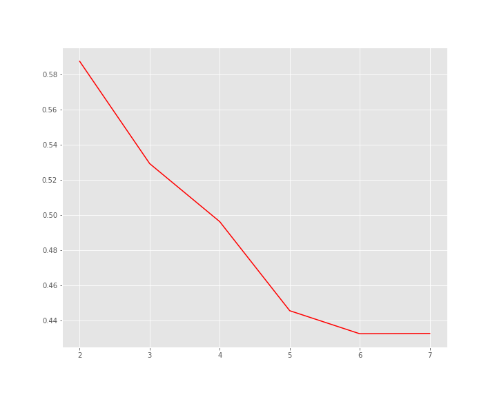
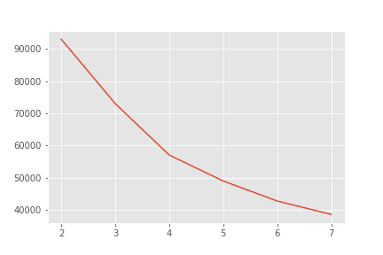

# Anime-Data-Analysis-and-Recommandation-System
Analysis of data provided by myanimelist, user clustring and designing a appropriate recommandation system.  
  
## EDA  
Frequency of ratings:  
  

Variation in ratings in different genres:  
  
  
All animes by composition:  
  
  
## Dimensionality reduction  
Reducing the dimensionality of the data using PCA for plotting. 
  
2D plot with data reduced to 3 dim:  
  
  
## User Clustring  
Clusting similar users using K-Means to find out more about animes popular between different types of users.  
  
Silhouette score plot:  
  
  
Inertia plot:  
  
