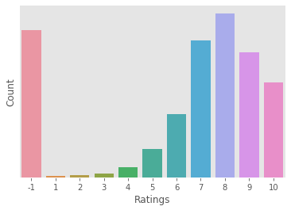
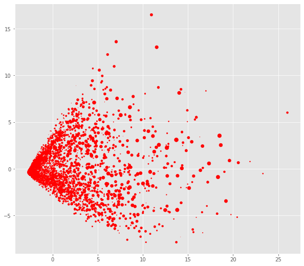

# Anime-Data-Analysis-and-Recommandation-System
Analysis of data provided by myanimelist, user clustring and designing a appropriate recommandation system.  
  
## Usage  
To find anime similar to a given anime:  
```bash
$python main.py <anime name> --anime  
  
$python main.py Samurai Champloo --anime  
Similar shows to Samurai Champloo include:  
  
No. 1: Cowboy Bebop  
No. 2: Great Teacher Onizuka  
No. 3: Tengen Toppa Gurren Lagann  
No. 4: Mushishi  
No. 5: Black Lagoon  
No. 6: Rurouni Kenshin: Meiji Kenkaku Romantan - Tsuioku-hen  
No. 7: Sen to Chihiro no Kamikakushi  
No. 8: Black Lagoon: The Second Barrage  
No. 9: Ghost in the Shell: Stand Alone Complex  
No. 10: Toki wo Kakeru Shoujo  
  
Runtime: 8.123 seconds  
```  
  
To find users similar to a given user and the anime popular among these types of user:  
```bash
$python main.py <user_id> --user  
  
$python main.py 19 --user 
----------------------------  
Most Similar Users:  
----------------------------  
User #6028, Similarity value: 0.67  
User #4646, Similarity value: 0.57  
User #8492, Similarity value: 0.56  
User #2464, Similarity value: 0.53  
User #2667, Similarity value: 0.53  
User #1709, Similarity value: 0.53  
User #5008, Similarity value: 0.52  
User #2126, Similarity value: 0.50  
User #5164, Similarity value: 0.50  
User #1156, Similarity value: 0.50  
  
----------------------------  
NAME & Similarity Value  
----------------------------  
Shingeki no Kyojin 3  
Sen to Chihiro no Kamikakushi 2  
Nana 2  
Cowboy Bebop 1  
Ookami Kodomo no Ame to Yuki 1  

Runtime: 16.73 seconds
```  
  
## EDA & User Clustring
Frequency of ratings:  
  

Variation of ratings by different genres:  
  
  
All animes by composition:  
  
  
## Dimensionality reduction  
Reducing the dimensionality of the data using PCA for plotting. 
  
2D plot with data reduced to 3 dim:  
  
  
## User Clustring  
Clusting similar users using K-Means to find out more about animes popular between different types of users.  
  
2D plot with user-base clustred into 4 clusters:  
  
  
Genre popularity by clusters:  
  
  
## Recommandation System  
The recommandation system is based on cosin_similarity between users and anime , users with other users and animes with other anime.  
  
## Dataset  
Data provided by myanimelist used. <a href="https://www.kaggle.com/CooperUnion/anime-recommendations-database">(link)</a>  
  
@PrakarshBhardwaj
