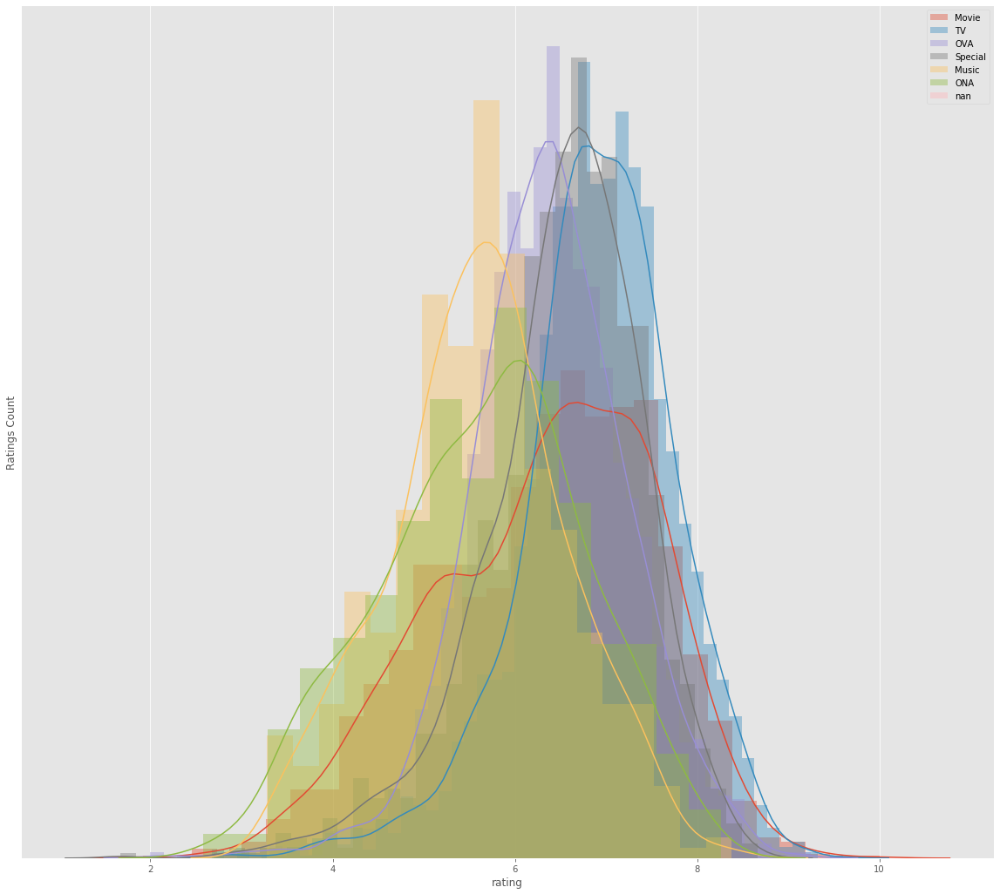
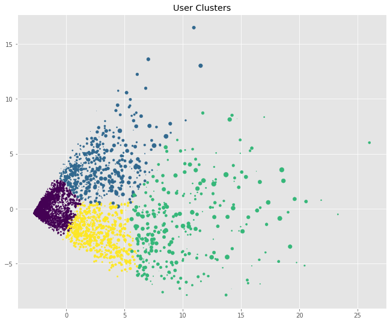
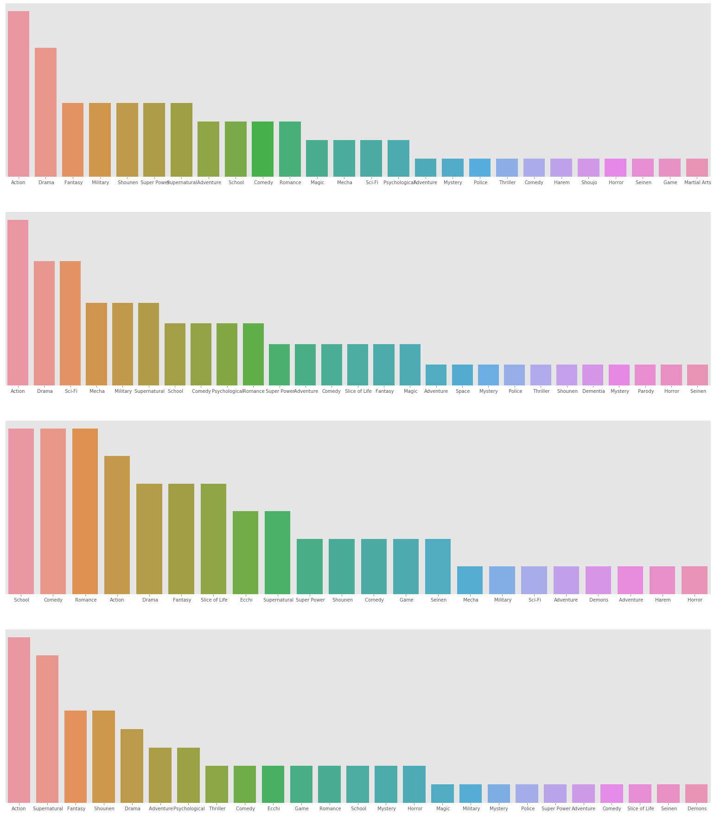

# Anime-Data-Analysis-and-Recommandation-System
Analysis of data provided by myanimelist, user clustring and designing a appropriate recommandation system.  
  
## Usage  
To find anime similar to a given anime:  
```bash
$python main.py <anime name> --anime
``` 

To find users similar to a given user and the anime popular among these types of user:  
```bash
$python main.py <user_id> --user
```  
  
## EDA & User Clustring
Frequency of ratings:  
  

Variation in ratings in different genres:  
  
  
All animes by composition:  
  
  
### Dimensionality reduction  
Reducing the dimensionality of the data using PCA for plotting. 
  
2D plot with data reduced to 3 dim:  
  
  
### User Clustring  
Clusting similar users using K-Means to find out more about animes popular between different types of users.  
  
2D plot with user-base clustred into 4 clusters:  
  
  
Genre popularity by clusters:  
  
  
## Recommandation System  
The recommandation system is based on cosin_similarity between users and anime.
  
@PrakarshBhardwaj
